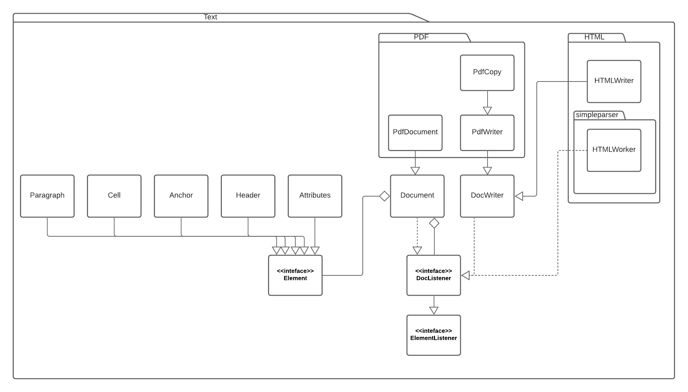

# Assignment 1

## Part 1

### Architecture

#### Diagram

#### Short Reasoning

Our goal was to show how the classes necessary for a simple `Hello World` program are built and how they interact with each other. 
For easier readability many classes between the classes implementing `Element` and `Element` itself have been left out. 
Relations which don't help the reader in understanding the structure of the projects have been ignored as well.

### Call Graph

## Part 2

### Six Methods