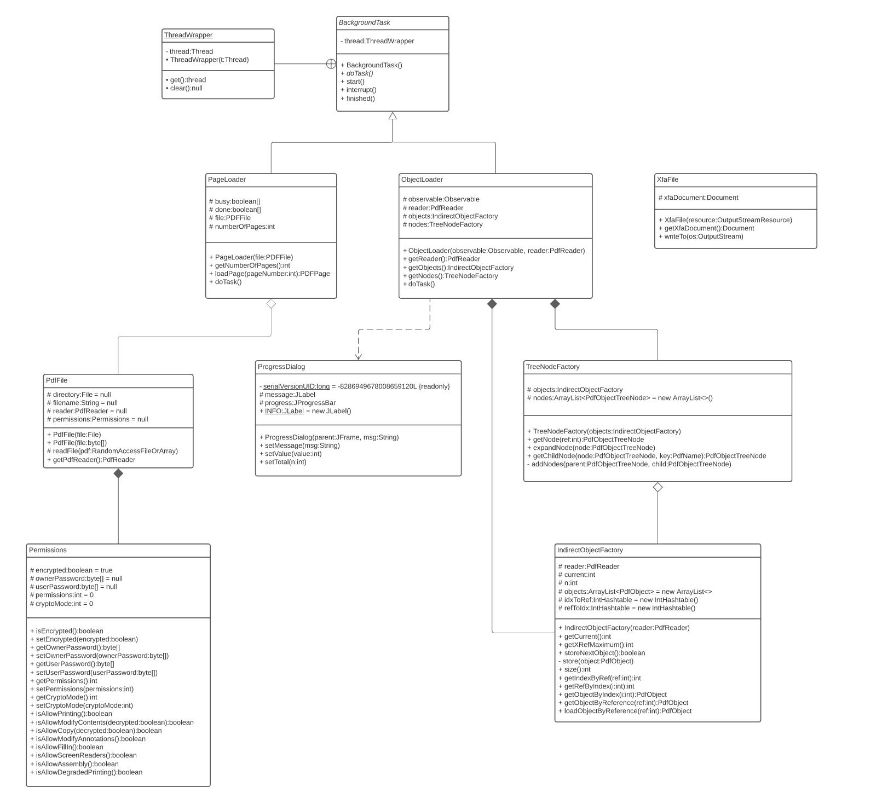

Assignment 2

## Part 1

In order for the project to work out of the box with IntellJ, please open the folder *Assignment_2* as root and mark the `src` directory as source folder. The battle will start with the execution of `Run.main()`. An example for creating a new board can be found in the `Game` file.

## Part 2

### Architecture

#### `com.lowagie.rups.model` UML diagram

