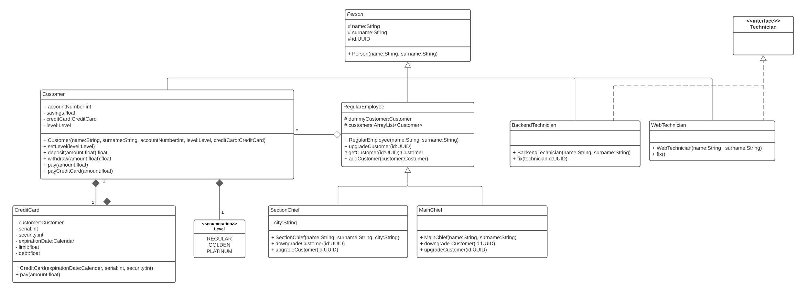

## Assignment 4

#### Person
The abstract class `Person` was chosen, which gets extended by `Employee`, `Customer` and the different Technicians.
Its only task is to create an ID (with the help of the `UUID` class) and store the name as well as surname.

#### Level
The indivuals levels (REGUALR, GOLDEN, PLATINUM) are represented with an enum.

#### Employee
The class `RegularEmployee` extends the abstract class `Person`. Both classes `SectionChief` and `MainChief` extend the `RegularEmployee`, with the Section Chief
additionally assigned to a city. 

#### Customer
The class `Customer`extends the abstract class `Person`. Each customer own a credit card as seen in the class diagram below. For simplicity
the money used when paying with the credit card is saved as `debt` and not substracted from the `savings`. The `debt` however cannot
exceed the limit on the credit card.

#### Technicians
Both technicians implement the interface `Technician`. It is only there for future simplicity, since  right now
there is extremely limited functionality in the two classes `BackendTechnician` and `WebTechnician`.

### Getters & Setters
For simplicity the Intellij plugin Lombok was chosen, which enables @Getter and @Setter to create simple methods for the
respective getters and setters. It must be installed manually using IntelliJ for the code to appear without any errors.
For more information please visit https://projectlombok.org/features/GetterSetter.

### UML Class Diagram

