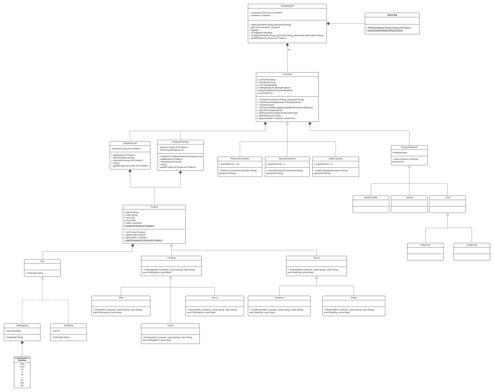

## Assignment 6
This project now uses gradle. In order for it to work, you will have to import the gradle projects.

Make sure to open the folder Assignment_6 separately with intellij and if there are any issues, try deleting your local copies of .gradle and .idea before reopening the project.

### Exercise 1

#### Model-View-Controller Pattern

##### Structure 

We have decided to use the strategy design pattern for the implementation details of 
the MVC pattern. Meaning the the ``View`` only communicates with the ``Controller`` and the 
``Model`` also only with the ``Controller``. The ``Controller`` implements all logic and decides 
how to react to specific user inputs. The ``View`` then only has to read the user input
and leaves the decision process to the ```Controller```

##### View
The ``View`` class is a straight forward user interface which works either using the
System.in and System.out Streams or it can also be driven by another virtual instance
using the ``handleInput`` method. 

##### Controller
The ``Controller`` parses the input strings and selects the proper algorithm to convert 
them into commands on the ``Model``. It also handles requests for displaying information
back to the ``View``.

##### Model
The ```Model``` takes care of all the data. It allows to update ``Employees``  instances, create new ones,
and delete them.  

#### Class Diagram

### Exercise 2

#### Disclaimer

To be absolutely honest this exercise was awkward to solve. Our solution isn't realistic considering a real life website. For example
our filter method would have been completely different as usually classes like Dress would be models and any ORM (like SQLAlchemy) 
would enable us to easily filter for objects we want. It also isn't clear how to deal with the frontend.

#### Class Diagram ShoppingSW



### Responsibility by Class

|   |   |
|---|---|
|Product                |The class Product is an abstract class for representing data about a single product. It also stores all of its instances in a static list.|
|Clothing, Shoes etc    ||
|Customer               |Representation of a customer. Responsible for validating password input, paying, setting customer specific settings like payment method.|
|ShoppingCart           |Responsible for dealing with items a customer intends to buy.|
|ProductsForSale        |Responsible for dealing with items a customer intends to sell.|
|ShoppingSW             |Class the user interacts with. It holds global information for instance to tell if a customer is logged in or not and locks functionality behind a username and password.|
|SearchBar              |The searchbar is meant filter results or search for a concrete product.|
|PaymentMethod          ||
