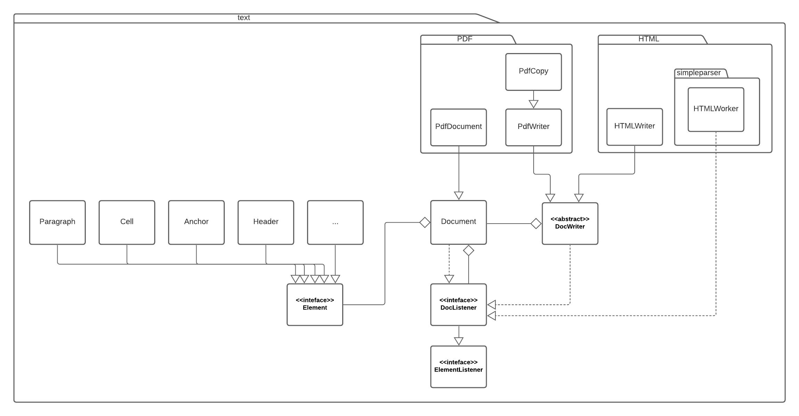
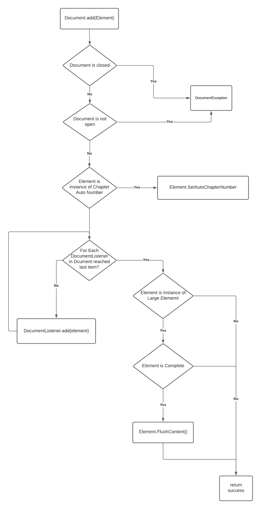

# Assignment 1

## Part 1

### Architecture

#### Diagram



#### Reasoning

As writing PDF files is one of the main tasks of the OpenPDF library, the focus lies on the creation of such a file. Furthermore, the HTML package is included
seeing that it is a great part of the library as well. The goal is to show the different layers of classes that are necessary for writing a `Hello World` file
(this will be shown more in detail in the following call graph). The diagram shows how the classes are connected to each other and on which parts of the library
most classes are built on. Naturally, there are several layers between the classes shown in the diagram (e.g. between several classes and the interface `Element`)
that are used for implementation/extension. For easier readability those have been left out. In addition, relations which do not help the reader understand the structure
have been ignored as well.

### Call Graph

#### Reasoning
Since there is no directly runnable entrypoint, we decided to use this simple `Hello World` script as our main entrypoint for the call graph below. 

```
// imports

public class HelloWorld {
    public static void main(String[] args) {
        Document document = new Document();
        try {
            final PdfWriter instance = PdfWriter.getInstance(document, new FileOutputStream("HelloWorld.pdf"));
            document.open();
            document.add(new Paragraph("Hello World"));
        } catch (DocumentException | IOException de) {
            System.err.println(de.getMessage());
        }
        document.close();
    }
}
```

#### Diagram


## Part 2

### Call Graphs of Six Methods

1. ``PdfProw.writeBorderAndBackground``

The method ``writeBorderAndBackground`` from the ``PdfProw`` Package is responsible for displaying cells.


2. `PdfDocument.outlineTree`

The method ``outlineTree`` from the PDFDocument package writes oultines in recursive fashion, thus the name *Tree*.


3. ``Document.add``

The ``add`` Method from the ``Document package`` is used to add ``Element``s to a Document. 

4. ``PDFString.toPDF``

The ``toPDF`` method from the ``PDFString`` package can convert a pdfString to a universally readable PDF File.

