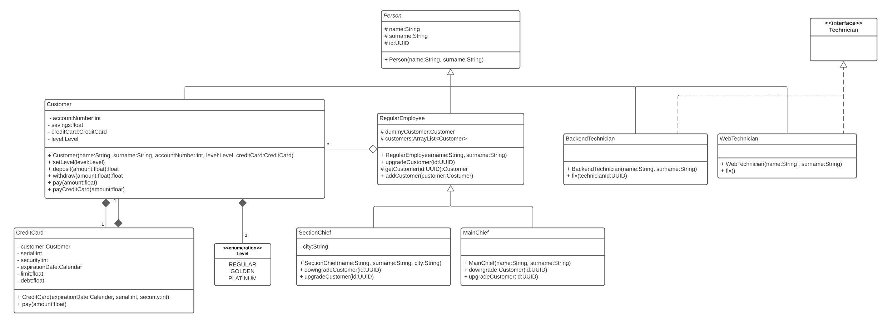

## Assignment 4
This project now uses gradle. In order for it to work, you will have to import the gradle projects.

Make sure to open the folder *assignment-4* directly with intellij and if there are any issues, try deleting your local copies of .gradle and .idea before reopening the project.

### Class Architecture

#### Person
The class `Person` is an abstract class to represent a human being.
It deals with storing the name, surname and ID (using the class `UUID`) of a person.
We chose an abstract class instead of an interface since this functionality will be exactly the same for all subclasses
and therefore it doesn't make sense to force them to implement it themself.

#### Level
The individual levels (`REGUALR`, `GOLDEN`, `PLATINUM`) are represented with an enum since we do not expect them to change frequently.
This also reduces the amount of possible errors and avoids the usage of the antipattern Primitive Obsession.

#### CreditCard
The class `CreditCard` has a reference to a `Level` and updates itself when its level changes.
This makes more sense than creating classes `RegularCreditCard`, `GoldenCreditCard` etc. since they are too similar at the moment.

#### Employee
The class `RegularEmployee` extends the abstract class `Person`. Both classes `SectionChief` and `MainChief` extend the `RegularEmployee`, with the Section Chief
additionally assigned to a city.
We used inheritance since they all share some basic functionality, which we assume potential future "customer service" roles
(like `RegularEmployee`, `MainChief`, `SectionChief`) will require as well.

#### Customer
The class `Customer`extends the abstract class `Person`. Each customer owns a credit card as seen in the class diagram below. For simplicity
the money used when paying with the credit card is saved as `debt` and not substracted from the `savings`.

#### Technicians
Both technicians implement the interface `Technician`. It is only there for future simplicity, since right now
there is extremely limited functionality in the two classes `BackendTechnician` and `WebTechnician`.

### Getters & Setters
For simplicity the Intellij plugin Lombok was chosen, which enables @Getter and @Setter to create simple methods for the
respective getters and setters. It must be installed manually using IntelliJ for the code to appear without any errors (File->Settings->Plugins).
For more information on the used @Getter and @Setter please visit https://projectlombok.org/features/GetterSetter.

### UML Class Diagram

