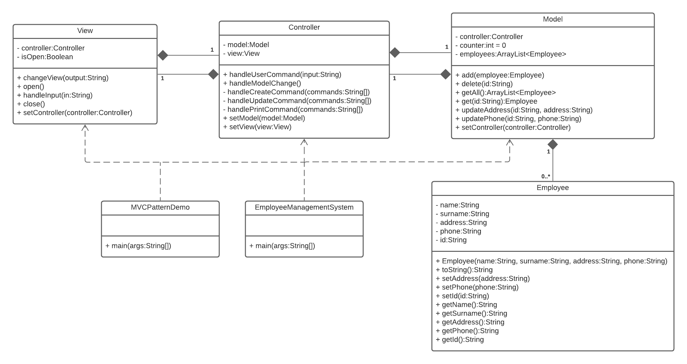

# Assignment 6
This project now uses gradle. In order for it to work, you will have to import the gradle projects.

Make sure to open the folder *assignment-6* separately with intellij and if there are any issues, try deleting your local copies of .gradle and .idea before reopening the project.

## Exercise 1

### Model-View-Controller Pattern

#### Structure

We have decided to use the strategy design pattern for the implementation details of
the MVC pattern. Meaning the the `View` only communicates with the `Controller` and the
`Model` also only with the `Controller`. The `Controller` implements all logic and decides
how to react to specific user inputs. The `View` then only has to read the user input
and leaves the decision process to the `Controller`

#### View
The `View` class is a straight forward user interface which works either using the
System.in and System.out Streams or it can also be driven by another virtual instance
using the `handleInput` method.

#### Controller
The `Controller` parses the input strings and selects the proper algorithm to convert
them into commands on the `Model`. It also handles requests for displaying information
back to the `View`.

#### Model
The `Model` takes care of all the data. It allows to update `Employees` instances, create new ones,
and delete them.

### Class Diagram

## Exercise 2

### Class Diagram ShoppingSW

### Responsibility by Class

|Class|Description|
|---|---|
|Product                |The class `Product` is an abstract class used for representing data about a single product. It also stores all of its instances in a static list. The sizes are split into integers for shoes and an enum containing alphabetic sizes for clothes to make it more realistic.|
|Clothing & Shoes       |`Dress`, `Pants` and `Shirt` are in the category `Clothing` hence extending the class, whereas `Boots` and `Sneakers` are in the category Shoes as described in the assignment. Inheritance is used to enable a simple filter function for the search bar.|
|Customer               |The abstract class `Customer`is a representation of a customer. It is responsible for validating password input, paying, as well as setting customer specific settings. Here the method `pay` is made protected since it's only used in the public `checkoutCart` method. Depending on the customer's state the upper bound for the amount of items sold simultaneously is defined. Here classes are used instead of an enum for simplicity if more customer states are added.|
|ShoppingCart           |The class `ShoppingCart` is responsible for dealing with items a customer intends to buy. Added products are saved in a private list accessible through a getter method.|
|ProductsForSale        |The class `ProductsForSale` is responsible for dealing with items a customer intends to sell. Again added products are saved in a private list accessible through a getter method. Additionally the `maxAmountProducts` defines how long the list is allowed to be depending on the customer's state.|
|ShoppingSW             |The user interacts with the class `ShoppingSW`. It holds global information (e.g. whether a customer is logged in or not) and locks functionality behind a username and a password.|
|SearchBar              |The searchbar is meant to filter results or search for a concrete product. It is made static for simplicity since there is not more than one search bar hence constant.|
|PaymentMethod          |The class `PaymentMethod` is an abstract class for representaing data about the selected payment. Since both debit and credit cards share the same attributes they inherit any data from the abstract class `Card`. Bank transfers and invoices are handled separately. Given no information in the assignment the classes are left empty.|
